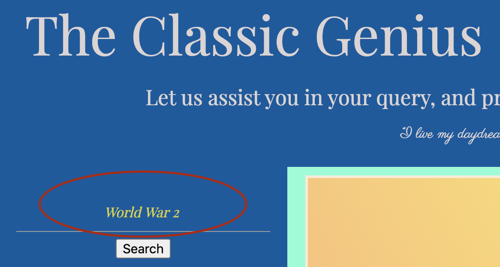
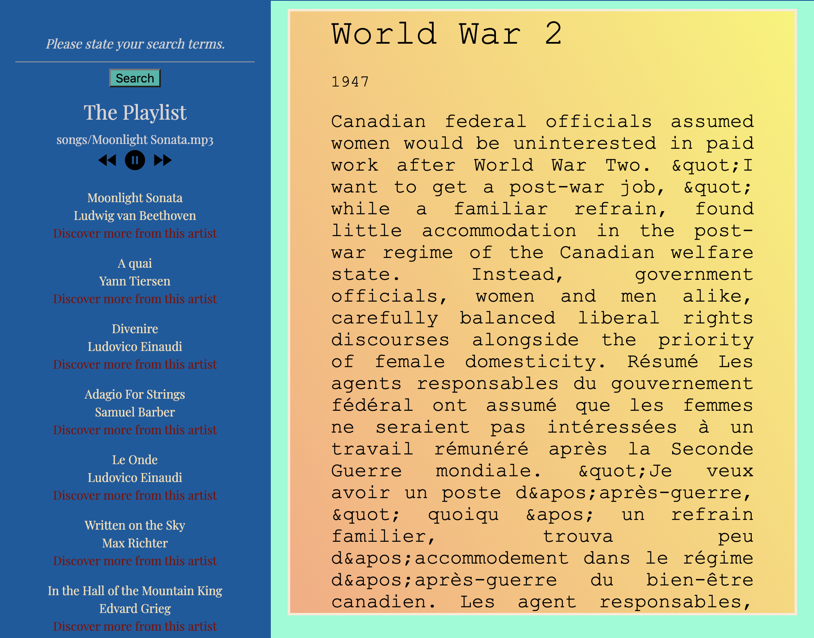
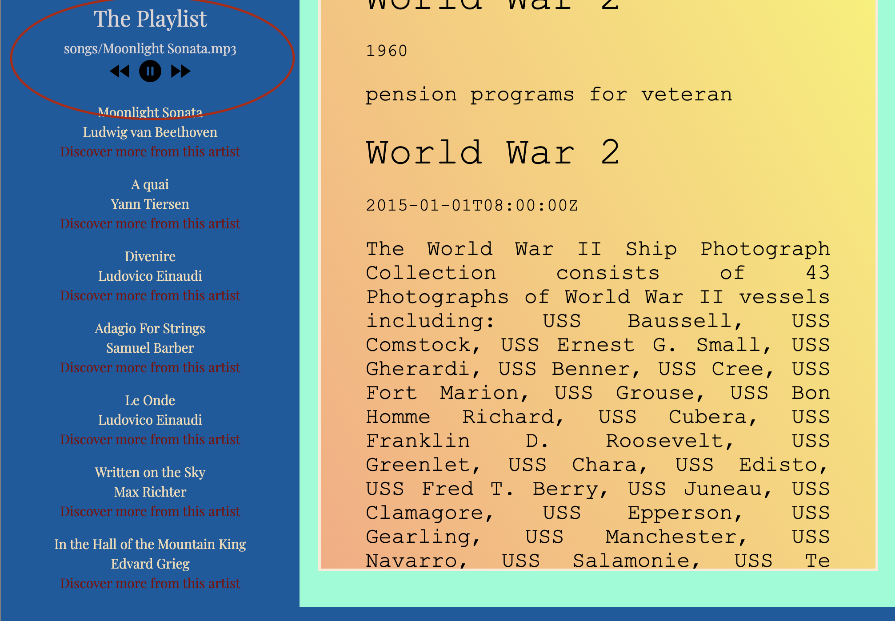

# The Classic Genius

## Description 

A research app to help users collect scholar research articles from all over the world, and give user an option to enhance their study with classical music. Moreover, if the user enjoy what they are hearing, there are links to lead user to a music library with more information on the artist and song playing. 

## User Story

AS A college student 
I WANT easy access to scholar research articles, while listening to classical music
SO THAT I can gather credible content to do my homework in an relaxing environment

## How It Works 

User can collect scholar articles from all over the world by inputing the topic they would like to know about in the search box. 

The articles are from a research library called CORE. The result is generated from an AJAX call. Please refer to article.js for specifics of functionality. Once user hit search, the results will appear inside the yellow box. 

On the left side of the page is a playlist of classical music from many famous composers. The user can click play to enhance their studying with some timeless pieces from Beethoven, Ludovico and more. There are also previous and next buttons should the user want to skip or go back to a song. 

If the user likes what they hear and would like to know more about the artist or get more songs of the same composer, they can click on "Discover more from this artist". This will take them to last.fm: one of the biggest online music library. 

## Contributors
Kim Le, Ryan Barwise, Demetrio Almeida, Chris Smith

## Deployment
 https://demetrio09.github.io/Project-1/
